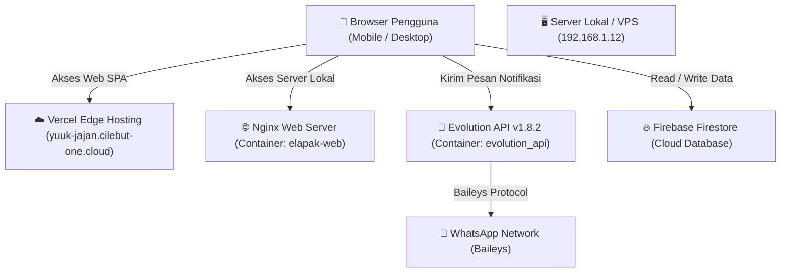

# 🛍️ Warung Digital / Yuuk Jajan (e-Lapak Kemnaker)

> **Platform Marketplace Digital Pegawai Kemnaker**  
> Wadah khusus bagi pegawai Kemnaker dan keluarga untuk bertransaksi produk makanan, minuman, dan olahan UMKM tanpa ongkos kirim.

---

## 📌 Daftar Isi
- [1. Ringkasan Proyek](#1-ringkasan-proyek)
- [2. Arsitektur & Teknologi](#2-arsitektur--teknologi)
- [3. Integrasi WhatsApp (Evolution API)](#3-integrasi-whatsapp-evolution-api)
- [4. Struktur Direktori](#4-struktur-direktori)
- [5. Konfigurasi Lingkungan & Docker](#5-konfigurasi-lingkungan--docker)
- [6. Panduan Menjalankan & Deployment](#6-panduan-menjalankan--deployment)
- [7. Troubleshooting & FAQ](#7-troubleshooting--faq)

---

## 1. Ringkasan Proyek

Warung Digital (Yuuk Jajan) adalah aplikasi web berbasis **Single Page Application (SPA)** yang memungkinkan:
- **Pembeli**: Menjelajahi lapak warung, memilih produk, memesan dengan sistem PO / ready stock, memilih metode bayar (Transfer, QRIS, COD), serta menerima update status via WhatsApp.
- **Penjual**: Membuka lapak warung, mengelola menu & stok, menerima notifikasi WhatsApp saat ada pesanan masuk, dan mengubah status pesanan (Diproses, Dikirim, Selesai, Dibatalkan).
- **Notifikasi Real-time**: Integrasi WhatsApp otomatis untuk transaksi dan pemulihan akun (reset password).

---

## 2. Arsitektur & Teknologi



| Komponen | Teknologi | Deskripsi |
|---|---|---|
| **Frontend** | Vanilla JavaScript (ES Modules), Tailwind CSS, Lucide Icons | Arsitektur SPA ringan tanpa build tool berat |
| **Database** | Firebase Firestore (10.9.0) | Penyimpanan cloud real-time (Users, Lapaks, Products, Orders, Chats) |
| **WA Gateway** | Evolution API v1.8.2 (Docker) | Gateway WhatsApp berbasis library Baileys |
| **Reverse Proxy** | Nginx & Cloudflare | Reverse proxy lokal dan manajemen SSL/TLS domain publik |
| **Hosting Web** | Vercel & Docker Container | High-availability cloud edge + fallback server lokal |

---

## 3. Integrasi WhatsApp (Evolution API)

Aplikasi terhubung langsung ke **Evolution API** di server untuk mengirim notifikasi transaksional secara otomatis.

### Kredensial & Konfigurasi Aktif
* **Server URL**: `https://wa.cilebut-one.cloud`
* **Nama Instance**: `umkm_vercel-app`
* **Global API Key**: `cilebut-ONE.server:2026`
* **Instance Token**: `cqpj5ch0avno6u7w0z67b`
* **Port Server Internal**: `8081` (Container port `8080`)

### Endpoint API & Format Payload
```http
POST https://wa.cilebut-one.cloud/message/sendText/umkm_vercel-app
Content-Type: application/json
apikey: cqpj5ch0avno6u7w0z67b
```

**Body Request (JSON):**
```json
{
  "number": "6285781335527",
  "textMessage": {
    "text": "Pesan notifikasi di sini..."
  }
}
```

### Fitur Notifikasi Otomatis
1. **Pesanan Baru Masuk (`app/pages/checkout.js`)**:
   - Dikirim ke WhatsApp Penjual secara otomatis saat pembeli menekan tombol checkout.
   - Berisi nomor pesanan, nama pembeli, rincian produk, total harga, alamat/ruangan pengantaran, dan link dashboard.
2. **Update Status Pesanan (`app/pages/dashboard.js`)**:
   - Dikirim ke WhatsApp Pembeli saat penjual mengubah status:
     - `processing` (Sedang diproses & estimasi tanggal siap).
     - `shipped` (Sedang dikirim ke meja/ruangan pemesan).
     - `completed` (Pesanan selesai).
     - `cancelled` (Pesanan dibatalkan).
3. **Lupa Kata Sandi (`app/pages/login.js`)**:
   - Mengirim token dan tautan reset kata sandi langsung ke nomor WhatsApp akun pengguna yang terdaftar.

---

## 4. Struktur Direktori

```text
c:\e-lapak\
├── app\                         # Kode Utama Aplikasi (SPA Modern)
│   ├── app.js                   # Router utama & inisialisasi aplikasi
│   ├── auth.js                  # Modul autentikasi pengguna
│   ├── firebase-init.js         # Konfigurasi koneksi Firebase Firestore
│   ├── store.js                 # Data layer / state management Firestore
│   ├── utils.js                 # Helper format uang, tanggal, dsb
│   ├── components\              # Komponen reusable (Navbar, Footer, ProductCard, Toast, Modal)
│   └── pages\                   # Halaman SPA (Home, Products, Checkout, Dashboard, Profile, Orders, Lapak, Login, Register)
├── css\                         # Styling CSS modul (variables, base, components, pages)
├── img\                         # Aset gambar & ilustrasi
├── docker-compose.yml           # Orkestrasi Docker (Nginx Web + Evolution API)
├── Dockerfile                   # Dockerfile untuk image Nginx SPA
├── nginx.conf                   # Konfigurasi Nginx Web Server & Proxy
├── vercel.json                  # Konfigurasi routing & proxy Vercel
├── deploy.py                    # Script otomatisasi deployment ke server via SSH/SFTP
├── deploy.ps1                   # Script deployment PowerShell
├── jalankan_lokal.bat           # Shortcut menjalankan dev server lokal
└── README.md                    # Dokumentasi lengkap proyek
```

---

## 5. Konfigurasi Lingkungan & Docker

File `docker-compose.yml` menggabungkan service web Nginx dan Evolution API:

```yaml
version: '3.8'

services:
  elapak-web:
    build: .
    container_name: elapak-web
    ports:
      - "8090:80"
    restart: unless-stopped
    environment:
      - NGINX_PORT=80

  evolution-api:
    image: atendai/evolution-api:v1.8.2
    container_name: evolution_api
    restart: always
    ports:
      - "8081:8080"
    environment:
      - SERVER_URL=https://wa.cilebut-one.cloud
      - SERVER_TYPE=http
      - SERVER_PORT=8080
      - CORS_ORIGIN=*
      - CORS_METHODS=GET,POST,PUT,DELETE,OPTIONS
      - CORS_CREDENTIALS=true
      - AUTHENTICATION_TYPE=apikey
      - AUTHENTICATION_API_KEY=cilebut-ONE.server:2026
      - AUTHENTICATION_EXPOSE_IN_FETCH_INSTANCES=true
      - LOG_LEVEL=ERROR,WARN,DEBUG,INFO,LOG,VERBOSE,DARK,WEBHOOKS
      - LOG_COLOR=true
      - LOG_BAILEYS=error
      - DEL_INSTANCE=false
    volumes:
      - evolution_instances:/evolution/instances
      - evolution_store:/evolution/store

volumes:
  evolution_instances:
    name: evolution_instances
  evolution_store:
    name: evolution_store
```

---

## 6. Panduan Menjalankan & Deployment

### Menjalankan di Lokal (Development)
1. Jalankan `jalankan_lokal.bat` atau jalankan web server lokal (misal: Python HTTP Server atau VS Code Live Server):
   ```powershell
   python -m http.server 8000
   ```
2. Buka browser pada `http://localhost:8000`.

### Deployment ke Server VPS / Lokal (Docker)
Jalankan script deployment otomatis dengan Python:
```bash
python deploy.py
```
*Script akan mendeteksi koneksi SSH, mengunggah file via SFTP, me-rebuild image docker `elapak-web`, dan me-restart container secara otomatis.*

### Deployment ke Cloud Hosting (Vercel)
Cukup lakukan commit dan push ke repository git:
```bash
git add .
git commit -m "Update konfigurasi dan fitur"
git push origin main
```
*Vercel akan otomatis mendeteksi perubahan dan memperbarui website pada `https://yuuk-jajan.cilebut-one.cloud` / `https://umkm-kemnaker.vercel.app`.*

---

## 7. Troubleshooting & FAQ

### Q: Kenapa status pesan WhatsApp tidak terkirim / Error 403?
* **Penyebab**: Proxy Cloudflare memblokir IP Datacenter Vercel (Bot Fight Mode) atau token API salah.
* **Solusi**: Pastikan aplikasi memanggil langsung domain `https://wa.cilebut-one.cloud` dari browser pengguna menggunakan token instance `cqpj5ch0avno6u7w0z67b`.

### Q: Bagaimana cara menghubungkan ulang nomor WhatsApp jika status "close"?
Jalankan perintah ini di terminal server untuk meminta QR Code baru:
```bash
curl -X GET https://wa.cilebut-one.cloud/instance/connect/umkm_vercel-app \
  -H "apikey: cilebut-ONE.server:2026"
```
Scan QR code yang muncul menggunakan menu **Perangkat Tertaut (Linked Devices)** di aplikasi WhatsApp pada ponsel Anda.

### Q: Bagaimana cara memeriksa status koneksi instance WhatsApp?
```bash
curl -X GET https://wa.cilebut-one.cloud/instance/fetchInstances \
  -H "apikey: cilebut-ONE.server:2026"
```
Pastikan properti `"status"` bernilai `"open"`.
